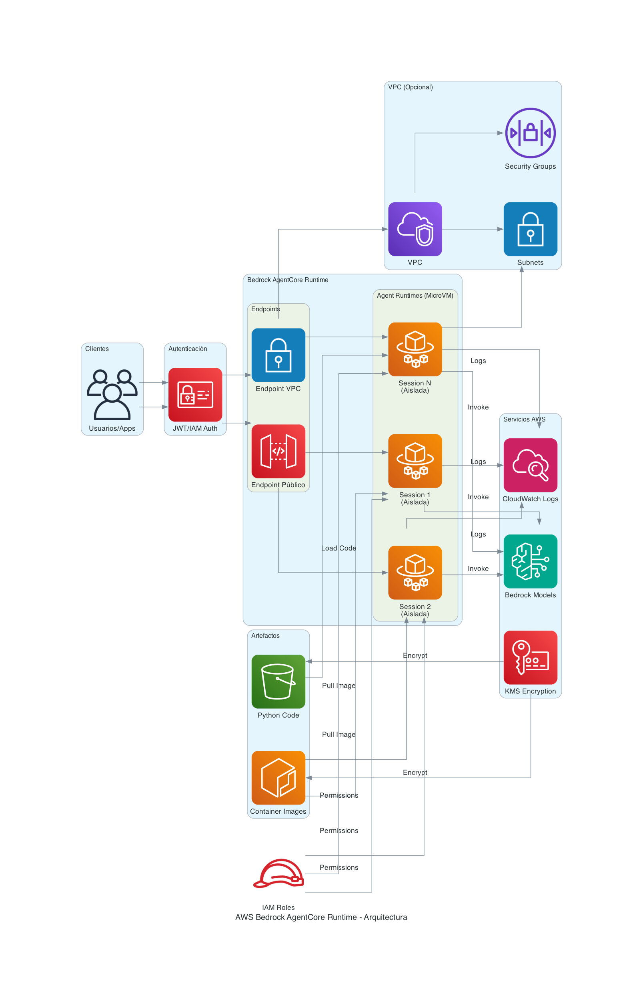

# Módulo Terraform: AWS Bedrock AgentCore Runtime

## Descripción

Módulo de Referencia Terraform para el despliegue y gestión de Amazon Bedrock AgentCore Runtime. Proporciona un entorno de ejecución containerizado seguro, escalable y completamente administrado para agentes de IA con soporte para múltiples protocolos (MCP, HTTP, A2A), autenticación JWT y redes VPC.

### ¿Qué es Amazon Bedrock AgentCore Runtime?

Amazon Bedrock AgentCore Runtime es un servicio serverless que proporciona un entorno de hosting seguro para desplegar agentes de IA con ejecución containerizada, aislamiento de sesiones en microVMs, soporte de protocolos MCP/HTTP/A2A, autenticación JWT/IAM y gestión del ciclo de vida.

## Diagrama de Arquitectura



## Estructura del Módulo

```
terraform-aws-bedrock-agentcore-runtime/
├── .gitignore
├── CHANGELOG.md
├── README.md
├── data.tf
├── locals.tf
├── main.tf
├── outputs.tf
├── providers.tf
├── variables.tf
├── versions.tf
└── sample/
    ├── README.md
    ├── data.tf
    ├── locals.tf
    ├── main.tf
    ├── outputs.tf
    ├── providers.tf
    ├── terraform.tfvars
    └── variables.tf
```

## Uso

```hcl
module "bedrock_agentcore" {
  source  = "git::https://github.com/org/terraform-aws-bedrock-agentcore-runtime.git?ref=v2.0.0"

  providers = {
    aws.project = aws.principal
  }

  client      = var.client
  project     = var.project
  environment = var.environment

  agent_runtimes = local.agent_runtimes_transformed
}
```

## Inputs

| Variable | Tipo | Requerido | Default | Descripción |
|----------|------|-----------|---------|-------------|
| `client` | `string` | Sí | - | Nombre del cliente (2-20 chars, minúsculas) |
| `project` | `string` | Sí | - | Nombre del proyecto (2-30 chars, minúsculas) |
| `environment` | `string` | Sí | - | Entorno: `dev`, `qa`, `pdn` |
| `agent_runtimes` | `map(object)` | No | `{}` | Mapa de configuraciones de AgentCore Runtimes |
| `additional_tags` | `map(string)` | No | `{}` | Tags adicionales para todos los recursos |
| `enable_encryption` | `bool` | No | `true` | Cifrado habilitado (forzado a true) |
| `kms_key_id` | `string` | No | `null` | ARN o alias de clave KMS |
| `enable_logging` | `bool` | No | `true` | Habilitar logging en CloudWatch |
| `log_retention_days` | `number` | No | `30` | Retención de logs en días |

### Estructura de `agent_runtimes`

```hcl
agent_runtimes = {
  "agent-key" = {
    description      = string           # Descripción del agente
    container_uri    = string           # URI de imagen ECR (opcional si code_configuration)
    role_arn         = string           # ARN del rol IAM (OBLIGATORIO, PC-IAC-023)
    network_mode     = string           # "PUBLIC" o "VPC" (default: "PUBLIC")
    protocol         = string           # "MCP", "HTTP" o "A2A" (default: "MCP")
    create_endpoint  = bool             # Crear endpoint (default: true)
    code_configuration = object({...})  # Alternativa a container_uri
    vpc_config       = object({...})    # Requerido si network_mode = "VPC"
    environment_variables = map(string) # Variables de entorno
    jwt_authorizer   = object({...})    # Autenticación JWT (opcional)
    lifecycle_config = object({...})    # Timeouts de sesión (default: 900s/28800s)
    allowed_headers  = list(string)     # Headers HTTP permitidos
    additional_tags  = map(string)      # Tags específicos del runtime
  }
}
```

## Outputs

| Output | Tipo | Descripción |
|--------|------|-------------|
| `agent_runtime_ids` | `map(string)` | Mapa de keys a IDs de runtime |
| `agent_runtime_arns` | `map(string)` | Mapa de keys a ARNs de runtime |
| `agent_runtime_versions` | `map(string)` | Mapa de keys a versiones |
| `endpoint_arns` | `map(string)` | Mapa de keys a ARNs de endpoints |
| `workload_identity_arns` | `map(string)` | Mapa de keys a ARNs de workload identity |
| `agent_runtime_configurations` | `map(object)` | Resumen consolidado (id, arn, version, endpoint_arn) |

## Requisitos

| Requisito | Versión |
|-----------|---------|
| Terraform | >= 1.5.0 |
| AWS Provider | >= 6.24.0, < 7.0.0 |

## Cumplimiento PC-IAC

| Regla | Descripción | Implementación |
|-------|-------------|----------------|
| PC-IAC-001 | Estructura de Módulo | 10 archivos raíz + 8 archivos en sample/ |
| PC-IAC-002 | Variables | Todas con type, description y validation. map(object) para for_each |
| PC-IAC-003 | Nomenclatura | Patrón `{client}-{project}-{env}-agentcore-{key}` en locals.tf. Replace a `_` por restricción API |
| PC-IAC-004 | Etiquetas | Tags con merge(), Name explícito, additional_tags expuesto |
| PC-IAC-005 | Providers | configuration_aliases = [aws.project] en versions.tf |
| PC-IAC-007 | Outputs | Granulares (IDs, ARNs), con description obligatorio |
| PC-IAC-010 | For_Each | for_each en todos los recursos con map(object) |
| PC-IAC-011 | Data Sources | Solo data sources genéricos permitidos en el módulo |
| PC-IAC-020 | Seguridad | Cifrado forzado, role_arn inyectado externamente |
| PC-IAC-023 | Responsabilidad Única | Solo recursos intrínsecos a AgentCore. Sin IAM roles/policies |

## Decisiones de Diseño

### 1. Nomenclatura con replace("-", "_")

El nombre del recurso `agentRuntimeName` se construye siguiendo el patrón PC-IAC-003 (`{client}-{project}-{environment}-agentcore-{key}`) pero los guiones se reemplazan por underscores (`_`) debido a la restricción de la API de AWS que solo permite el patrón `[a-zA-Z][a-zA-Z0-9_]{0,47}`. El tag `Name` mantiene la nomenclatura estándar con guiones.

### 2. role_arn obligatorio (PC-IAC-023)

El módulo no crea roles IAM internamente. El `role_arn` es un campo obligatorio que debe ser inyectado desde el dominio de Seguridad. Esto cumple con el principio de Responsabilidad Única y la separación de dominios (PC-IAC-022).

### 3. Cifrado forzado (PC-IAC-020)

La variable `enable_encryption` está forzada a `true` mediante validación. No es posible desplegar recursos sin cifrado.

### 4. Patrón de transformación en sample/ (PC-IAC-026)

El directorio `sample/` sigue el flujo: `terraform.tfvars → variables.tf → data.tf → locals.tf → main.tf`. Los IDs dinámicos (como `role_arn`) se declaran vacíos en tfvars y se inyectan desde data sources en `locals.tf`.
